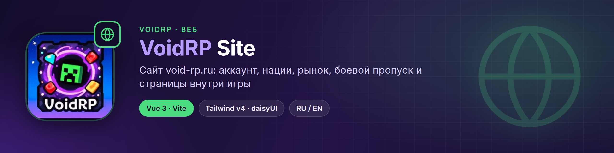
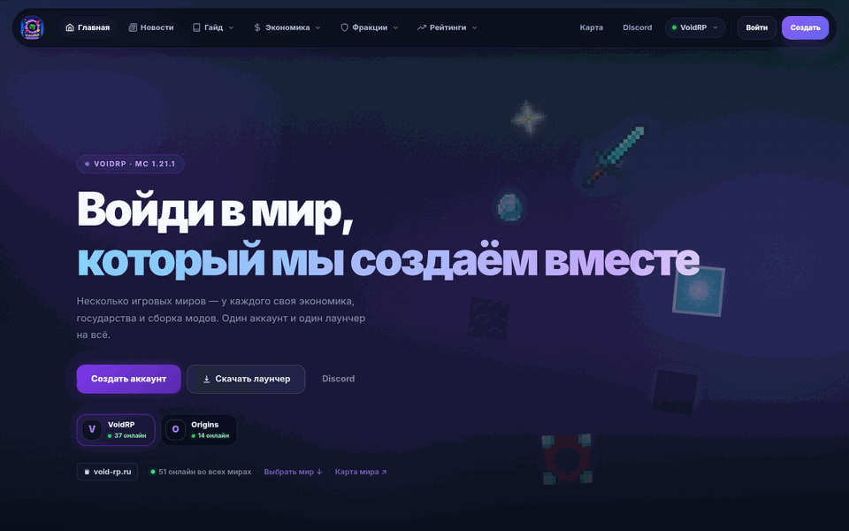
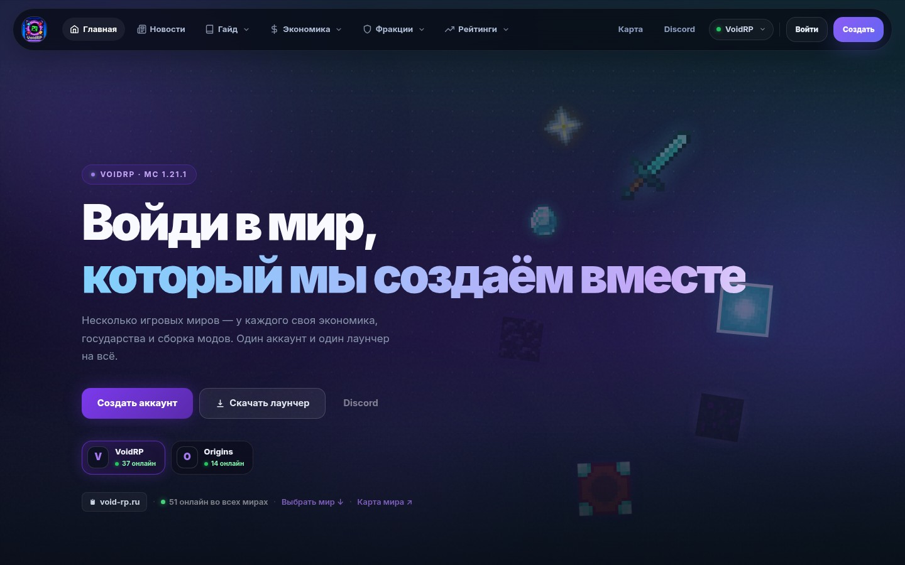
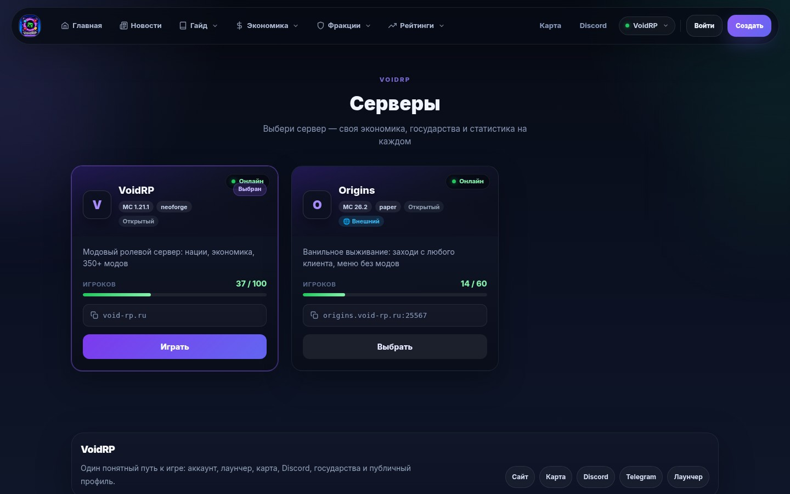
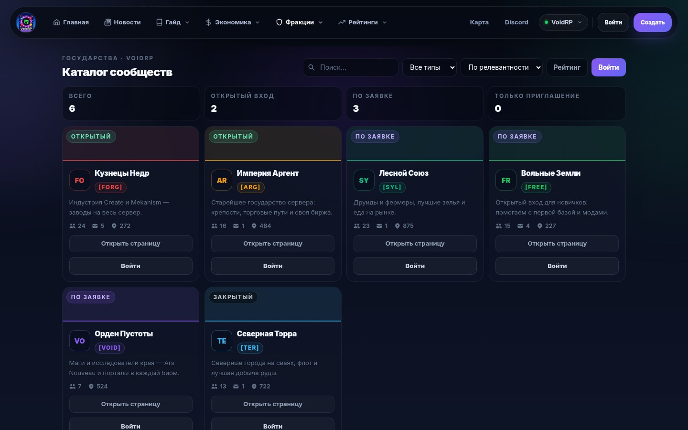
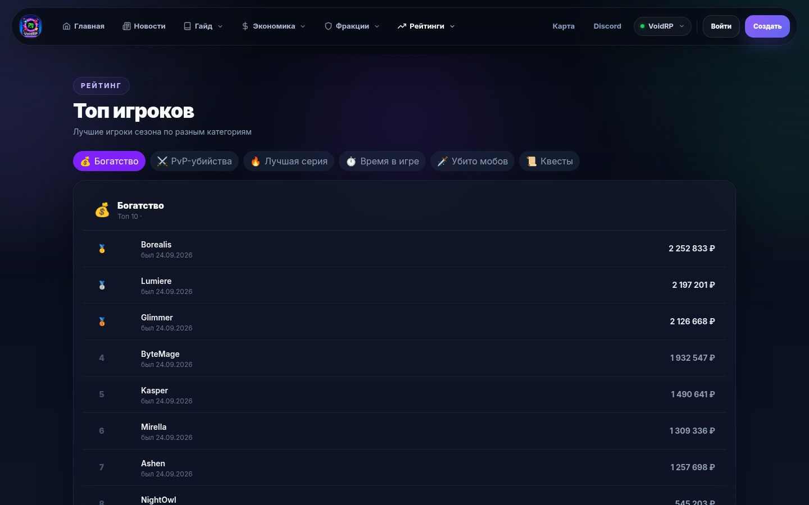
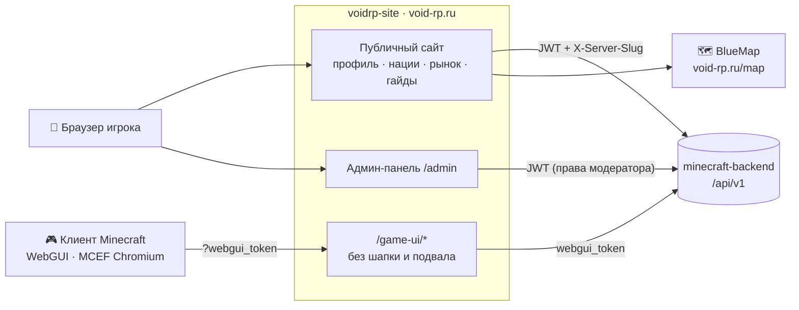
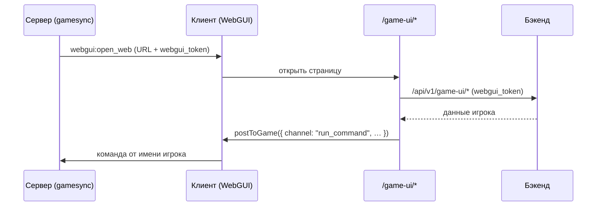

<p align="center"></p>

<div align="center">


[](https://github.com/VOIDRP-MINECRAFT/voidrp-site/actions/workflows/build.yml)


</div>

> Официальный сайт [void-rp.ru](https://void-rp.ru): аккаунт и профиль, серверы и гайды, нации и альянсы,
> рынок и магазин, боевой пропуск, карта, правовые документы, админ-панель — и страницы `/game-ui/*`,
> которые открываются прямо в игре во встроенном Chromium.

---

## 📸 Как это выглядит

<p align="center"></p>

<table>
<tr>
<td width="50%"><br><sub>Главная: миры, онлайн и быстрый старт</sub></td>
<td width="50%"><br><sub>Выбор сервера — своя экономика у каждого мира</sub></td>
</tr>
<tr>
<td width="50%"><br><sub>Рынок игроков: ордера, спред, последние сделки</sub></td>
<td width="50%"><br><sub>Каталог государств</sub></td>
</tr>
<tr>
<td width="50%"><br><sub>Топ игроков по категориям</sub></td>
<td width="50%"><br><sub>Боевой пропуск: рейтинг сезона</sub></td>
</tr>
</table>

<sub>Сняты с локальной сборки (`vite dev`) на демо-данных: ники, государства и цены вымышлены.</sub>

---

## 🗺️ Место в экосистеме



---

## ✨ Страницы и возможности

### Публичный сайт

| | |
|---|---|
| 🔐 **Аккаунт** | Регистрация с согласиями, вход, сброс пароля, подтверждение почты, привязка Telegram |
| 👤 **Профиль** | Скин и аватар, статистика, публичный профиль `/u/:slug` с настройкой видимости, соцсети, рефералы |
| 🌍 **Серверы** | Витрина `/servers` и переключатель сервера в шапке; разделы показываются по флагам `features` сервера |
| 📖 **Гайды** | `/server-guide` — гайд выбранного сервера (RU/EN); для основного сервера — подробный гайд по модпаку |
| 🏛️ **Нации** | Список и рейтинги, страница нации, студия нации, альянсы |
| 💹 **Экономика** | Рынок с историей цен и ордерами, магазин доната с корзиной и промокодами |
| 🏆 **Прогресс** | Боевой пропуск, топ игроков, лидерборды |
| 🗺️ **Карта** | BlueMap с нациями; игроки видны, только если разрешили это на сайте |
| ⚖️ **Документы** | Оферта, политика обработки ПДн по 152-ФЗ, согласия, условия платных услуг; аналитика — только после согласия на cookie |
| 📰 **Контент** | Новости, моды сборки, полезные ссылки, скачивание лаунчера |

### Админ-панель `/admin`

Игроки и наказания, античит, аудит, модераторы с гранулярными правами, серверы (CRUD и авто-провижининг),
мониторинг и RCON, моды и пересборка манифеста, лаунчер (краши и правила краш-советника), боевой пропуск,
косметика, торговец, апгрейдер, донат, новости, лендинг, метрика, предложения модов и обратная связь.

**Мульти-сервер:** активный сервер хранится в `stores/serverStore.js` (`localStorage voidrp_active_server`);
`services/apiBase.js` шлёт `X-Server-Slug` на **каждый** запрос (opt-out `serverScope:false`), а `App.vue`
перерисовывает страницы при смене сервера.

---

## 🎮 In-game UI (`/game-ui/*`)

Страницы, которые сервер открывает поверх игры через WebGUI. Без шапки и подвала (`hidePublicShell: true`),
авторизация — `?webgui_token=`.



| Маршрут | Что это |
|---|---|
| `/game-ui/menu` | Главное меню (клавиша F6) |
| `/game-ui/hud` | HUD-оверлей: уведомления, подсказки, статус торговца |
| `/game-ui/welcome` | Приветствие и гайд новичка |
| `/game-ui/market` · `/game-ui/nmarket` | Рынок игроков · рынок наций |
| `/game-ui/treasury` · `/game-ui/research` · `/game-ui/alliance` | Казна, исследования, альянс |
| `/game-ui/battlepass` · `/game-ui/quests` · `/game-ui/roadmap` | Боевой пропуск, квесты, дорожная карта |
| `/game-ui/leaderboards` · `/game-ui/notifications` · `/game-ui/settings` | Рейтинги, уведомления, настройки |
| `/game-ui/cosmetics` | Косметика |
| `/game-ui/trader` | Лавка странствующего торговца (открывается только у NPC) |
| `/game-ui/upgrader` | Апгрейдер |

### Composables и API

```js
import { isInMod, useWebGuiToken, useWebGuiClient, postToGame } from '@/composables/useWebGui.js'
import { setWebguiToken, getOrderBook, createPendingAction } from '@/services/gameUiMarketApi.js'

setWebguiToken(useWebGuiToken())                // строка из ?webgui_token=
const client = useWebGuiClient()                // ref: { playerUuid, username, dimension, pos, server }

if (isInMod()) {
  const book = await getOrderBook('minecraft:iron_ingot')
  await createPendingAction('buy', { item_key: 'minecraft:iron_ingot', amount: 64, price: 100 })
  await postToGame({ channel: 'run_command', command: '/pm pickup' })
}
```

---

## 📋 Требования

| Компонент | Версия |
|---|---|
| Node.js | 22 (как в CI) |
| Yarn | 1.x |

---

## 🚀 Быстрый старт

```bash
yarn install --frozen-lockfile
cp .env.example .env       # VITE_API_BASE_URL оставь пустым для dev
yarn dev --host            # dev-сервер; /api и /media проксируются на прод-API
yarn build                 # продакшн-сборка → dist/ (как в CI)
```

---

## 🏗️ Структура

```
src/
├── config.site.js      адреса сайта и API, ссылки на Discord/Telegram, карта
├── router/index.js     Vue Router 4, мета-флаги feature/hidePublicShell
├── stores/             authStore, serverStore (активный сервер)
├── services/           apiBase (401 → auto-refresh, X-Server-Slug) и API-модули по разделам
├── composables/        useWebGui, usePageMeta, useGameUiSettings, …
├── data/serverGuides.js  гайды серверов
├── views/              публичные страницы, GameUi*View, admin/*
├── i18n/locales/       ru.js, en.js
└── components/
```

---

## 🌍 Интернационализация

Весь UI доступен на русском и английском языках. Новые строки добавляются в оба файла:

```bash
src/i18n/locales/ru.js   # ru.market.orderBook: "Книга ордеров"
src/i18n/locales/en.js   # en.market.orderBook: "Order Book"
```

---

## 🔗 Связанные репозитории

| Репо | Связь |
|---|---|
| [minecraft-backend](https://github.com/VOIDRP-MINECRAFT/minecraft-backend) | REST API — все данные приходят отсюда |
| [voidrp-webgui-neoforge](https://github.com/VOIDRP-MINECRAFT/voidrp-webgui-neoforge) | Мод, который открывает `/game-ui/*` в игре |
| [voidrp-gamesync-plugin](https://github.com/VOIDRP-MINECRAFT/voidrp-gamesync-plugin) | Подписывает URL (`webgui_token`) и открывает страницы |
| [voidrp-launcher-vue](https://github.com/VOIDRP-MINECRAFT/voidrp-launcher-vue) | Лаунчер; скачивается со страницы `/download-launcher` |

---

<div align="center">
<a href="https://void-rp.ru">🌐 Сайт</a> ·
<a href="https://github.com/VOIDRP-MINECRAFT">🏠 Организация</a> ·
<a href="https://github.com/VOIDRP-MINECRAFT/.github/blob/main/docs/WEBGUI_ARCHITECTURE.md">📐 WebGUI Architecture</a>
</div>
